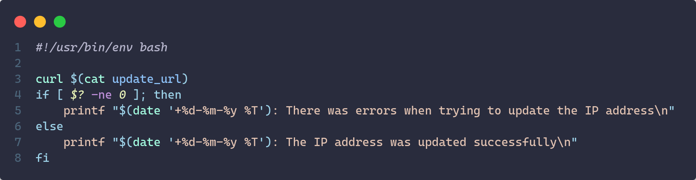
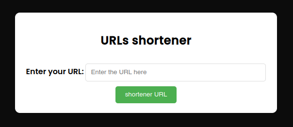

# Web server deployment

## Project Overview

Automated deployment of a web server made with Docker containers. The server is composed by a main domain with the main page of the web, and serveral subdomains used for two aplications: **an url shortener and a youtube video and audio downloader**. 
We have another two subdomain, one of these for the grafana monitoring interface and another one for the jenkins panel administration.

## Structure

```
├── web-server
│   ├── certbot
│   │   ├── htdocs
|   |   |   └── index.html
|   |   └── httpd.conf
|   ├── dyndns
|   |   ├── Dockerfile
|   |   ├── cronjob
|   |   ├── geturl.sh
|   |   └── update.sh
│   ├── url-shortner
|   |   ├── static
|   |   |   └── style.css
|   |   ├── templates
|   |   |   └── index.html
|   |   ├── tests
|   |   |   ├── test_path.py
|   |   |   └── test_unitary.py
|   |   ├── app.py
|   |   ├── dns_manager.py
|   |   ├── Dockerfile
|   |   ├── requirements.txt
|   |   └── widgets.py
|   ├── web
|   |   ├── htdocs
|   |   |   ├── admin
|   |   |   |   └── index.html
|   |   |   ├── assets
|   |   |   ├── styles
|   |   |   |   └── style.css
|   |   |   ├── .htpasswd
|   |   |   ├── contact.html
|   |   |   ├── error404.html
|   |   |   ├── forbidden403.html
|   |   |   ├── index.html
|   |   |   └── logo.png
|   |   ├── httpd-vhosts.conf
|   |   └── httpd.conf
|   ├── web-downloader
|   |   ├── static
|   |   |   └── style.css
|   |   ├── templates
|   |   |   └── index.html
|   |   ├── app.py
|   |   ├── Dockerfile
|   |   └── requirements.txt
|   ├── .gitignore
|   ├── Jenkinsfile
|   ├── LICENSE
|   ├── Makefile
|   ├── README.md
|   ├── compose.yml
|   ├── prometheus.yml
|   └── test.hurl

```

## Key Features

- Self-hosted deployment leveraging **Docker Compose** for container orchestation.
- Secure access through **HTTPS** via Let's Encrypt certificates and reverse proxy configured with Apache
- System Monitoring with **Grafana**.
- **CI/CD Pipeline** using Jenkins.

> It's important to note that the **CI/CD pipeline** is still under development.

## Dependencies

The required dependecies for deploy the project are:

- Docker
- Python
- docker-composed
- make

## Technologies used

- **Programming Languages**: Python
- **Frameworks**: Flask
- **Libraries**: 
    - **Requests**: Requests
    - **Generate short url**: Hashlib
    - **Testing**: Pytest

## Previous configurations

### Router configurations

In this project the server will be my personal computer, which does not have a public IP, so we must map port 80 of our router with port 8080 of our machine, as well as port 443 with port 4433 of localhos to allow HTTPs traffic.

We have to login in the router and go to the *NAT/PAD* that is usually where we can open ports (at least in Orange routers)

#### Dynamic DNS 

As we do not have a static IP configured in our router, but we have a dynamic IP that changes from time to time, we will need a dynamic DNS service for our domain to point to our IP even though it may change.
In this case, I have purchased the domain from IONOS, so **this documentation is based on the steps to follow to configure the dynamic DNS service with IONOS as the provider**.

The first thing we have to do is to generate an API KEY to be able to interact with the IONOS service. To do this we have to visit the web: https://developer.hosting.ionos.es/?source=IonosControlPanel, go to the IONOS developer section and here we will find an option called manage keys.

<div align="center">
    
</div>

To make sure that the IP is always update we encapsulated this service in a docker container that is running cron updating the IP address every minute. We've created an image using the official Docker's Debian image where we copy the script `update.sh` to the container and a crontab will be running the script every minute.

<div align="center">
    
</div>

## Web server configuration

### Obtain the SSL certificates via Cerbot

In order to provide a safe and encrypted connection to our server, we will need a valid certificate. We will do using [certbot](https://hub.docker.com/r/certbot/certbot) which is a docker image provide by [**Let's Encrypt**](https://letsencrypt.org/es/), an open and free certificate authority.

Cetbot uses the ACME (Automatic Certificate Management Enviroment)  protocol, provided by Let's Encrypt to obtain and renewing the SSL certificates.

#### How Certbot and ACME work together

1. **Domain Ownership Validation**:
    - Certbot proves to the Let's Encrypt Certificate Authority (CA) that you control the domain for which you are requesting an SSL certificate.

    - The ACME protocol facilitates this validation process.

2. **Validation method**: Certbot uses severals methods to complete domain validation, in our case, we're going to explain the HTTP-01 Challenge that is what we used in this project, to more info about the other methods you can check the [certbot official documentation](https://eff-certbot.readthedocs.io/en/stable/)

    - **HTTP-01 Challenge**: Is a method used by Certbot and other ACME clients to validate domain ownership for SSL/TLS certificate issuance. It works by creating a unique token and placing it in a specific file (/.well-known/acme-challenge/*TOKEN*) on your server. The Certificate Authority (CA), such as Let's Encrypt, then makes an HTTP request to retrieve this file and confirm its contents. If the file is correctly served, the CA verifies that you control the domain and issues the certificate. This method requires the domain to be publicly accessible via HTTP (port 80) but is simple to automate, making it ideal for many web servers.

3. **Certificate Issuance**:
    - Once ownership is confirmed, Let's Encrypt issues an SSL/TLS certificate for your domain.

    - Certbot downloads and configures this certificate, usually placing the files in `/etc/letsencrypt/live/-yourdomain-/`.

4. **Automatic Renewal**:
    - Certificates from Let's Encrypt are valid for 90 days.

    - Certbot includes a built-in renewal mechanism *(certbot renew)*, which ensures your certificates remain valid without manual intervention.

### Apache configuration

The main web server will be running in a Docker container with the official image of Apache: [**httpd**](https://hub.docker.com/_/httpd)

```yaml
web:
    image: httpd:latest
    container_name: web
    env_file:
        - .env
    volumes:
        - ./web/htdocs:/usr/local/apache2/htdocs
        - ./web/httpd.conf:/usr/local/apache2/conf/httpd.conf
        - ./web/httpd-vhosts.conf:/usr/local/apache2/conf/extra/httpd-vhosts.conf
        - certs:/etc/letsencrypt
    ports:
        - 8080:80
        - 4433:443
```

As we can see we map the certs docker volume to the container directory **/etc/letsencrypt**. The certificates will be located at **/etc/letsencrypt/live/[your-domain]/fullchain.pem** and **/etc/letsencrypt/live/[your-domain]/privkey.pem**

#### Virtual hosts configuration

**The server have several virtual hosts configured**, one is for the main server, and we have another four virtual hosts, two of them for the applications **url shortener and youtube downloader**, other for the **Grafana monitoring system** and another one for the **Jenkins administration panel**.

##### Reverse proxy configuration

**Apache acts as an intermediary**, forwarding external client requests to the internal services, allowing this services to remain isolated from direct public access.

How can see for example in the virtual host for the url shortener application, we forward HTTP requests to the internal service at `http://url-shortener:5000/`.

<div align="center">
    
</div>

## Url shortener app

The url shortener app is a web service deployed as part of the self-hosted infrastructure at `https://url.sporestudio.me`. Its primary purpose is to simplify lengthy URLs into compact links, making them easier to share or manage.

### Key features
-  **Custom Shortened URLs**: Converts longs URLs into concise, shareable links.

- **Hash-Based Identification**: Uses a hashing algorithm (SHA-256) to generate unique codes for each URL.

- **Persistent Storage**:Ensures that shortened links are stored in a database for retrieval and analytics.

- **Redirect Service**: Automatically redirects users from the short link to the original, full URL.

### Technology Stack
- **Backend**:
    - Built using **Python** with the [**Flask**](https://flask.palletsprojects.com/en/stable/) web framework.

    - Implements cryptographic functions via the [hashlib](https://docs.python.org/3/library/hashlib.html) library for generating unique hash codes for URLs.

- **Frontend**: A minimal interface for submitting URLs, generating shortened links, and monitoring usage.

- **Database**: In this case we've used the **DNS server** of IONOS as database, storing the links as **TXT type records** within the server.

- **Reverse Proxy**: Managed through Apache, which handles HTTP(S) requests to the app.


### Workflow

First the users **submit a long URL** through the app interface.

<div align="center">
    
</div>

Then we catch this long url input by the users via form through POST method. To this long url we apply a function that generates a **hash of 6 alphanumeric characters**, which will be our short url, and using the function of our library [dns_manager.py](https://github.com/sporestudio/web-server/blob/main/url-shortener/dns_manager.py), created by us, we create a **TXT record in the DNS server with the shortened url** and then print it in the index.html using the render_template function of Flask.

```python
def shortener_url(original_url):
    return hashlib.sha256(original_url.encode()).hexdigest()[:6]


@app.route('/', methods=['GET', 'POST'])
def index():
    if request.method == 'POST':
        original_url = request.form['url']
        short_url = shortener_url(original_url) 
        
        if create_txt_record(short_url, original_url):
            url_shortener = f"https://url.{DOMAIN_NAME}/{short_url}"
            return render_template('index.html', short_url=url_shortener, original_url=original_url)
        else:
            return "Error creating DNS TXT record", 500

    return render_template('index.html')
```

Finally **we have to handle the redirection** from the short url to the long url making use again of the [dns_manager.py](https://github.com/sporestudio/web-server/blob/main/url-shortener/dns_manager.py) library, where we make a DNS query so that if there is a TXT record for that short url we redirect it to the value of that record (which is the original url).

```python
@app.route('/<short_url>')
def redirect_url(short_url):
    original_url = get_original_url(short_url)
    if original_url:
        return redirect(original_url)
    else:
        return "Short url not found", 404
```

### Tests

## YouTube downloader app

## Grafana monitoring tool

## CI/CD Pipeline with Jenkins

## License

This project is under <a href="https://github.com/sporestudio/web-server/blob/main/LICENSE">GNU General Public License v3.0</a>.

## Contribute

Want to contribute? There are multiple ways you can contribute to this project. Here are some ideas:

* [Translate the web into multiple languages!](./CONTRIBUTING.md#translations)
* [Fix some easy issues](CONTRIBUTING.md#Reporting-Issues)
* [Or check out some other issues](CONTRIBUTING.md#Reporting-Issues) (or translate them).

## Author

Created by <a href="https://github.com/sporestudio/">sporestudio</a>.